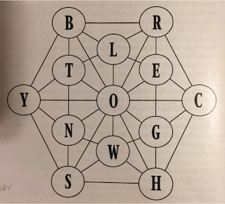

# Puzzler 2020

Find all words in this bi-directional graph:



## Python

There are two Python implementations of this in the repo.  The initial version is
about 60 lines long, but has generally the good performance.  The other version
was written to see how little code could be used and is 3 lines long and contains
240 characters.

```
$ time ./puzzler.py | wc -l
     484

real	0m0.607s
user	0m0.399s
sys	0m0.081s
```

```
$ time python3 pzr.py /usr/share/dict/words | wc -l
     484

real	0m1.528s
user	0m1.183s
sys	0m0.094s
```

Both of these programs use the same approach and use sets to check if each (overlapping)
pair of characters in the string are valid for the graph.

## Bash/shell

After writing the short version in Python I was curious to see if I could write
a still shorter program using bash.  In the end it was possible to implement
this via a single `grep` command (totally 166 characters):

```
$ cat /usr/share/dict/words | time ./puzzler.sh | wc -l
        0.26 real         0.25 user         0.00 sys
     484
```

Performance of this is surprisingly good and the regex used while long is not
actually very complicated.  The main trick to using the regex was to rely on
matching words not in the graph and then negate that match with `-v` in `grep`.

## Rust

As the grep command was faster than the Python code I was then intrigued to see
if using Rust would be faster still.  When compiled in release mode it is
faster than the grep command:

```
$ make puzzlerrs
rustc -C opt-level=3 puzzler.rs -o puzzlerrs
$ time ./puzzlerrs | wc -l
     484

real	0m0.193s
user	0m0.147s
sys	0m0.012s
```

This one relies on using Rust's match statement, which should compile to
pretty efficient code.

## C

Next is a version in C.  This was surprisingly compact and makes use of `strchr`
for pretty decent speed (I assume that `strchr` is usually well optimised).  This
actually appears to be faster than the Rust version too.
```
$ make puzzlerc
gcc -O3 puzzler.c -o puzzlerc
$ time ./puzzlerc | wc -l
     484

real	0m0.039s
user	0m0.028s
sys	0m0.011s
```

## Benchmarking speed

For this I used [hyperfine](https://github.com/sharkdp/hyperfine) (installable via `brew install hyperfine`).  This confirms
that the C version is fastest and the short Python program is the slowest:
```
$ make benchmark
hyperfine --warmup 3 './puzzler.py' 'python3 pzr.py /usr/share/dict/words' 'cat /usr/share/dict/words | ./puzzler.sh' './puzzlerrs' './puzzlerc'
Benchmark #1: ./puzzler.py
  Time (mean ± σ):     256.1 ms ±   7.2 ms    [User: 236.9 ms, System: 14.6 ms]
  Range (min … max):   249.9 ms … 268.9 ms    11 runs
 
Benchmark #2: python3 pzr.py /usr/share/dict/words
  Time (mean ± σ):     845.6 ms ±   4.5 ms    [User: 816.0 ms, System: 22.6 ms]
  Range (min … max):   840.4 ms … 853.9 ms    10 runs
 
Benchmark #3: cat /usr/share/dict/words | ./puzzler.sh
  Time (mean ± σ):     143.7 ms ±   4.3 ms    [User: 140.1 ms, System: 5.9 ms]
  Range (min … max):   137.9 ms … 154.8 ms    20 runs
 
Benchmark #4: ./puzzlerrs
  Time (mean ± σ):      99.3 ms ±   6.1 ms    [User: 95.5 ms, System: 2.4 ms]
  Range (min … max):    91.6 ms … 112.6 ms    29 runs
 
Benchmark #5: ./puzzlerc
  Time (mean ± σ):      16.6 ms ±   0.9 ms    [User: 14.3 ms, System: 1.3 ms]
  Range (min … max):    15.4 ms …  20.6 ms    147 runs
 
Summary
  './puzzlerc' ran
    6.00 ± 0.49 times faster than './puzzlerrs'
    8.67 ± 0.53 times faster than 'cat /usr/share/dict/words | ./puzzler.sh'
   15.46 ± 0.94 times faster than './puzzler.py'
   51.06 ± 2.75 times faster than 'python3 pzr.py /usr/share/dict/words'
```
